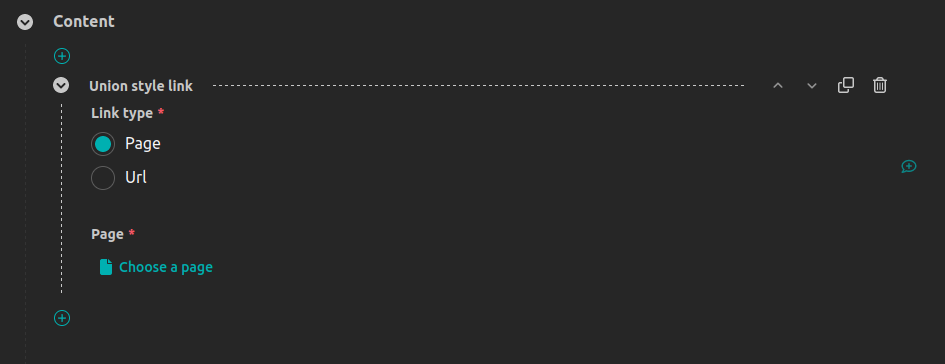

# RFC : Union Block

* RFC:
* Author: Joshua Munn <public@elysee-munn.family>
* Created: 2024-03-09
* Last Modified: 2024-03-09

## Abstract

This RFC proposes the implementation of a new stream field block type in Wagtail, the `UnionBlock`. The `UnionBlock` is a block type that presents editors with a choice of block types, allowing them to select one and insert a single corresponding "block" of content. The available choices for a given `UnionBlock` instance are defined by the developer, as with `StreamBlock`.

A proof of concept implementation can be reviewed at [https://github.com/jams2/wagtail/tree/feature/union-block](https://github.com/jams2/wagtail/tree/feature/union-block).

## Motivation

Wagtail's `StreamField` allows editors to author content with a great degree of flexibility. The facilities that enable this are the various `Block` types, which can be broadly summarised (some omissions for brevity) as follows:

- `StreamBlock`, a non-homogeneous sequence of other blocks;
- `ListBlock`, a homogeneous sequence of some block;
- `StructBlock`, a type that allows a set of blocks to be combined into a single compound block; and
- `FieldBlock` and its subclasses - atomic block types that capture a single value.

One notable omission from this family of types is a block that captures a single value from a union of types.

Unions are incredibly useful - they represent _choice_. Choice is currently represented in the block type family by `StreamBlock`. `StreamBlock` allows editors to create content comprised of any number of any type of block, in any order (subject to developer-defined constraints). However, Wagtail's block type family does not provide any facility for choice at the atomic block level, as `StreamBlock` is a sequence type.

`StreamBlock` is poorly suited to modelling a _single_ value, chosen from a union of types. The attempt to shoehorn `StreamBlock` into this use case is common, results in a suboptimal user experience for editors, and requires developers to write unwieldy code to work around the mismatch between use case and implementation.

### Example: Using `StreamBlock` to represent a single choice

### Impact on UX

A common request from users of Wagtail CMS instances is the functionality to include a link in some fragment of structured content (e.g. as part of a call to action), where that link might point to:

- a web resource not provided by the Wagtail instance;
- a `Page` in the Wagtail instance; or
- an email address, etc.

In an attempt to provide the required UI (while working within the tools provided by Wagtail's core) developers will often implement a `StreamBlock` with a choice of link types, as illustrated below.

```python
class LinkChooserBlock(blocks.StreamBlock):
    page = blocks.PageChooserBlock()
    url = blocks.URLBlock()

    class Meta:
        max_num = 1


class LinkBlock(blocks.StructBlock):
    title = blocks.CharBlock()
    link = LinkChooserBlock()
```


The UI generated for inserting a link requires editors to first select the "+" button to insert a block, and then choose the block type. In the typical case that the link value is _required_ this creates dissonance between what is required by data validation and what is communicated to users by visual language - requiring users to insert a block when that block is required is a sub-par experience. Compare this to a link block implemented as a `UnionBlock`:



In this example all fields required to make a valid submission are immediately present in the UI, which clearly communicates the requirements of the system to users and prevents a class of validation errors from occurring.

### Impact on code quality

Data inserted in stream fields is typically destined to be rendered as HTML and served as part of a web page. To facilitate this, blocks which implement a choice of types for a single value may be required to go through a process of narrowing to facilitate each possible sub-block's particular rendering requirements. In the case of our `LinkChooserBlock` example, we will need to invoke Wagtail's page URL resolution machinery if the page option is selected. A typical solution is to implement a custom `StructValue` class for the `LinkBlock`.

``` python
class LinkStructValue(blocks.StructValue):
    def get_url(self):
        block = self.get("link")[0]
        if (block_type := block.block_type) == "page":
            if block.value and block.value.live:
                return block.value.url
        elif block_type == "url":
            return block.value
```

Developers must deal with the fact the `link` field on `LinkBlock` is a sequence, which:

- is a poor mapping of the solution domain onto the problem domain; and
- requires error handling for the case that the sequence might be empty, regardless of the current validation constraints (the author suspects that developers that have worked with Wagtail regularly will empathise with the need for this).

## Specification

## Open Questions
